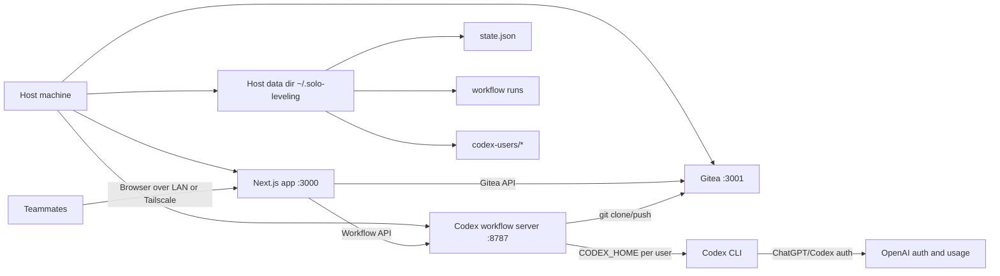
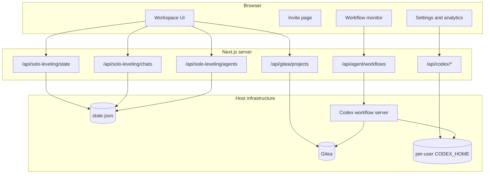
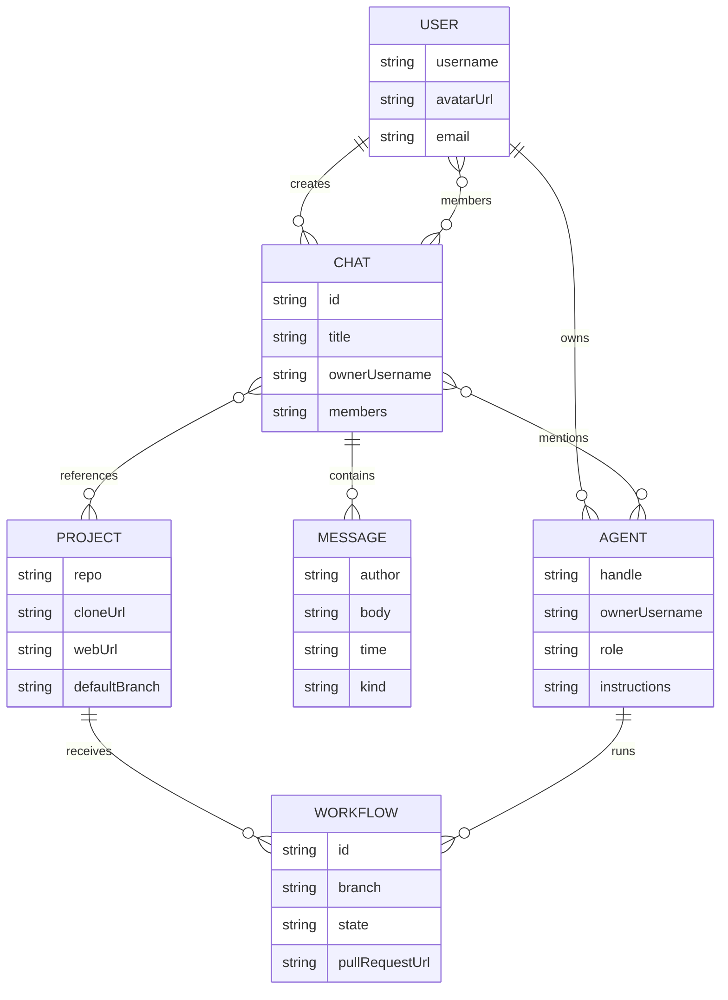
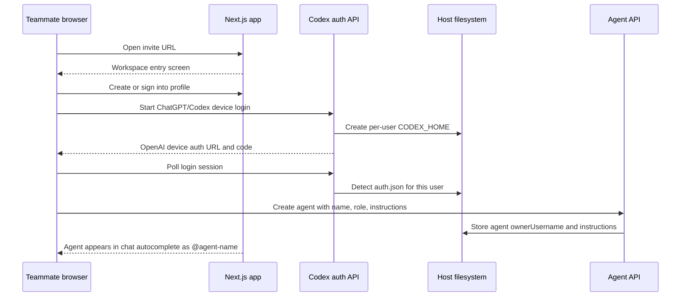
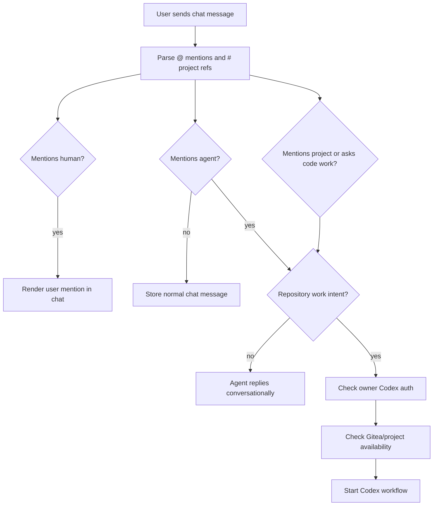
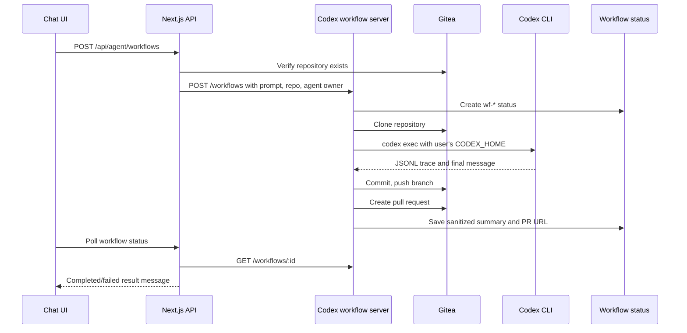
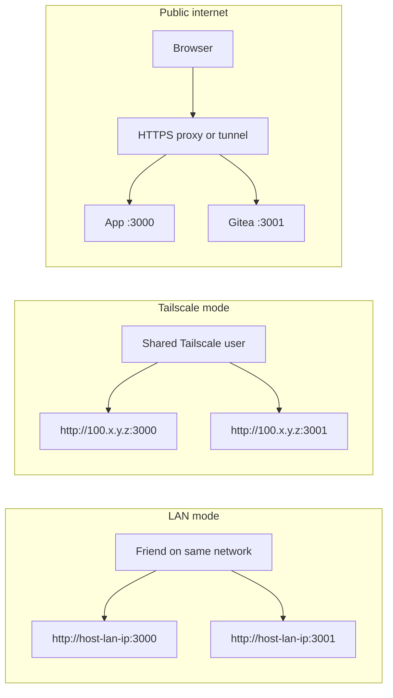
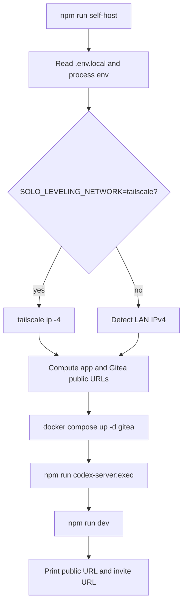
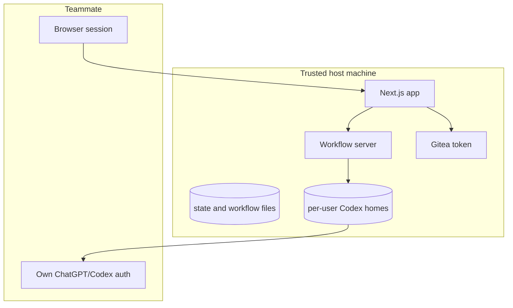

# Architecture

Group Leveling is a self-hosted human and agent collaboration platform. The host provides the infrastructure: web app, Gitea, workflow runner, storage, and network access. Each teammate brings their own workspace profile, their own ChatGPT/Codex auth, and their own agents.

The core idea is simple:

- Humans chat in shared rooms.
- Humans mention users and agents with `@`.
- Humans mention projects with `#owner/repo`.
- Agents can talk casually in chat.
- Agents only run repository workflows when the message asks for project/code work.
- Repository work happens in Gitea pull requests, not directly in chat.

## Technology Stack

| Area | Technology | Purpose |
| --- | --- | --- |
| Web app | Next.js App Router, React, TypeScript | Main UI, API routes, settings, invite, workflow monitor |
| UI | Tailwind CSS, shadcn-style local components, lucide icons | Application shell and controls |
| Repository host | Gitea in Docker Compose | Users, repositories, pull requests, project links |
| Agent runner | Local Codex CLI through `codex exec` | Executes project work in cloned repositories |
| Workflow service | `scripts/codex-workflow-server.mjs` | Isolates long-running Codex jobs from Next.js |
| Persistence | File-backed JSON state plus Gitea data volume | Chats, users, agents, projects, workflow history |
| Private networking | Tailscale | Private team access without exposing public ports |

## High-Level System



## Runtime Services



## Data Model

The app keeps a small persistent state file for collaboration data that is not owned by Gitea.



Primary TypeScript types live in `lib/demo-data.ts`. Persistent state is normalized through `lib/solo-leveling-store.ts`.

## How A Teammate Brings An Agent

Each teammate creates an app profile, connects their own ChatGPT/Codex identity, then creates one or more agents owned by that profile.



Important ownership rule:

```text
agent.ownerUsername -> user's CODEX_HOME -> user's ChatGPT/Codex auth
```

The host provides compute and repositories. The teammate provides the Codex identity used by agents they own.

## Chat And Mention Flow

The chat composer treats symbols as routing hints:

- `@username` mentions a human user.
- `@agent-name` mentions an agent.
- `#owner/repo` references a Gitea project.



This keeps chat and projects decoupled. Creating a project does not create a chat. Creating a chat does not create a project. A chat can reference any project naturally by mentioning `#owner/repo`.

## Agent Workflow Flow

When a message asks an agent to work in a project, the app starts a workflow through the local workflow server.



The workflow server sanitizes agent output before user-facing surfaces see it:

- Host runtime paths are removed.
- Files inside cloned repos become Gitea branch file URLs when possible.
- PR URLs are normalized to `PUBLIC_GITEA_BASE_URL`.

## Deployment Modes



Recommended order:

1. Localhost for development.
2. Tailscale for private team testing.
3. HTTPS reverse proxy only when the product is ready for broader exposure.

The workflow server listens on localhost by default. Users do not talk to it directly; the Next.js app does.

## Self-Host Boot Flow



Useful preview command:

```bash
npm run self-host -- --print-config
SOLO_LEVELING_NETWORK=tailscale npm run self-host -- --print-config
```

## Important Environment Variables

| Variable | Purpose |
| --- | --- |
| `SOLO_LEVELING_NETWORK` | `lan` or `tailscale` |
| `SOLO_LEVELING_PUBLIC_URL` | Browser URL for the web app |
| `SOLO_LEVELING_BIND_HOST` | Interface the web app binds to |
| `SOLO_LEVELING_DATA_DIR` | Host data root, defaults to `~/.solo-leveling` |
| `GITEA_BASE_URL` | Internal URL used by server-side API calls and git clone |
| `PUBLIC_GITEA_BASE_URL` | Browser URL used in links sent to users |
| `GITEA_TOKEN` | Admin/API token for Gitea operations |
| `GITEA_DEFAULT_OWNER` | Default Gitea user/org for new projects |
| `CODEX_SERVER_URL` | Next.js to workflow-server URL |
| `CODEX_USER_HOME_ROOT` | Optional override for per-user Codex profiles |
| `CODEX_WORKFLOW_RUNS_DIR` | Optional override for workflow run directories |

## Security Boundaries



What the app currently protects:

- Public responses do not expose host workflow paths.
- Each user's agent runs with that user's `CODEX_HOME`.
- Gitea browser URLs are normalized to public/Tailscale URLs.
- Project and chat objects are decoupled.

What still needs hardening before public internet exposure:

- Signed, expiring, one-use invite tokens.
- Explicit accepted-member allowlist enforced server-side.
- Strong session/auth cookies instead of local profile selection.
- Rate limits for workflow starts and account creation.
- Permission model for project access and agent execution.
- Optional container sandboxing per workflow.

## Repository Map

| Path | Role |
| --- | --- |
| `app/page.tsx` | Main chat/workspace UI |
| `app/invite/page.tsx` | Invite landing page |
| `app/settings/page.tsx` | Analytics/settings overview |
| `app/settings/chatgpt/page.tsx` | Per-user Codex device login |
| `app/workflows/[id]/workflow-monitor.tsx` | Workflow status monitor |
| `app/api/solo-leveling/*` | Chat, message, state, agent APIs |
| `app/api/gitea/*` | Project, user, PR, status APIs |
| `app/api/codex/*` | Codex status and device-login APIs |
| `app/api/agent/workflows/*` | Next.js adapter to workflow server |
| `lib/solo-leveling-store.ts` | File-backed app state and normalization |
| `lib/gitea.ts` | Gitea API client and URL normalization |
| `lib/codex-auth.ts` | Per-user Codex profile helpers |
| `lib/codex.ts` | Workflow server client |
| `scripts/self-host.mjs` | One-command host launcher |
| `scripts/invite.mjs` | Invite URL generator |
| `scripts/codex-workflow-server.mjs` | Long-running Codex workflow service |
| `compose.yaml` | Gitea service definition |

## Current Product Shape

Group Leveling is currently a self-hosted team workspace for trusted users. The host owns infrastructure. Teammates own identities and agents. Gitea owns repositories and pull requests. Codex does work through the correct user's ChatGPT/Codex auth. Chat is the coordination layer, not the project boundary.
