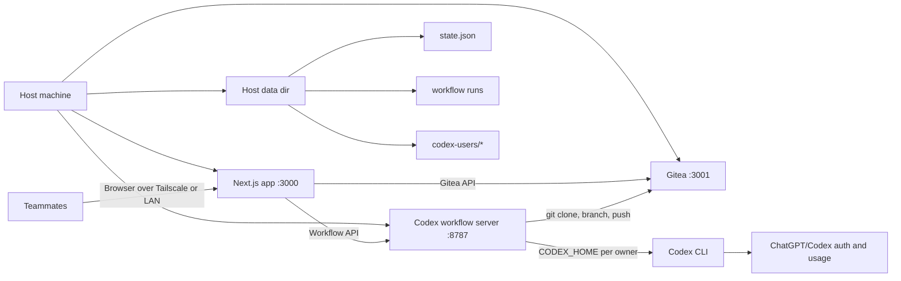
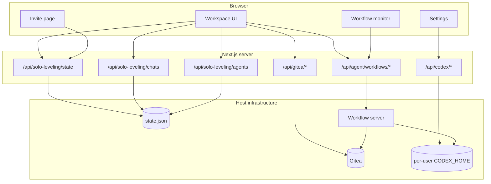
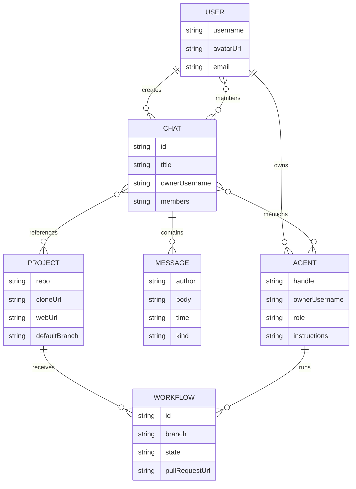
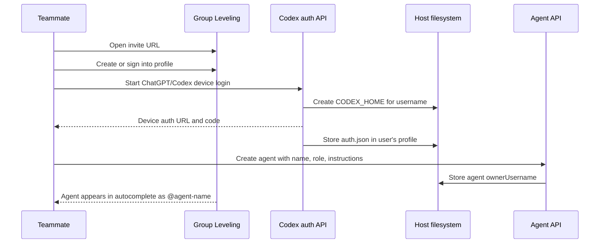
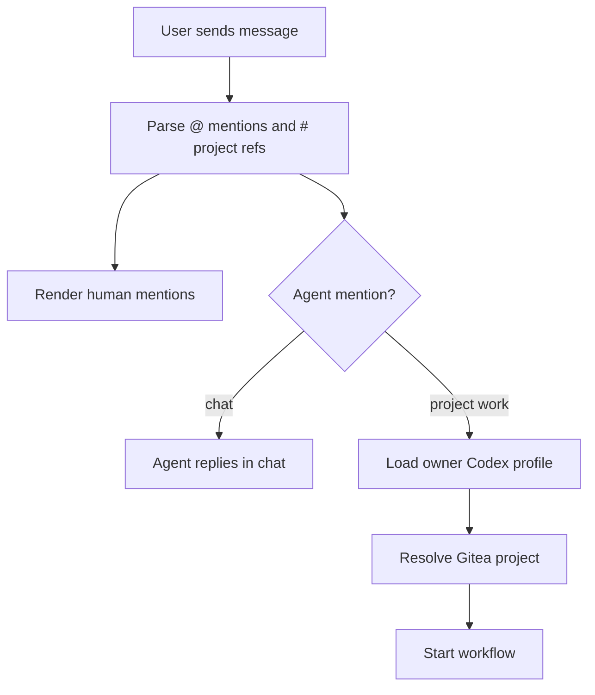
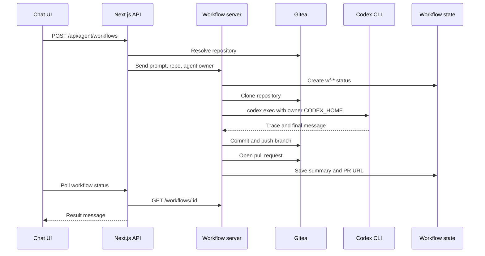
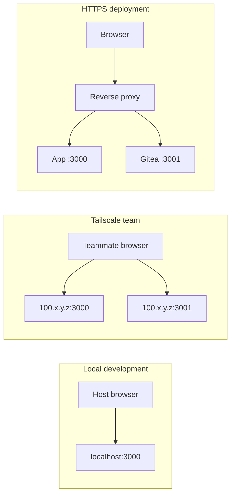
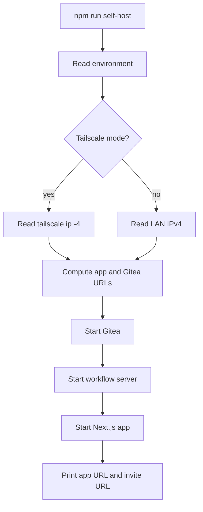
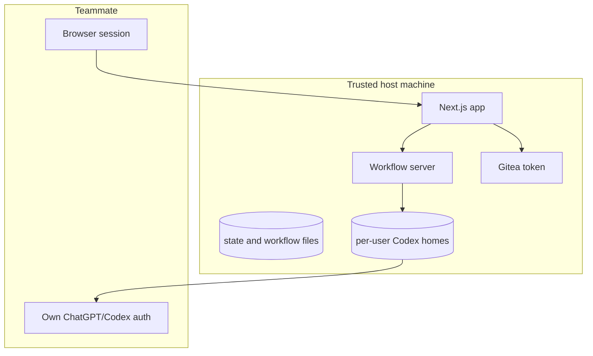

# Architecture

Group Leveling is a self-hosted workspace for human-agent collaboration. The host machine provides the app, Gitea, workflow execution, state, and private network access. Teammates provide their own workspace identity, ChatGPT/Codex auth, and agents.

## Product Model

- Chat is the coordination layer.
- Gitea is the project and pull request layer.
- Codex is the execution layer.
- Tailscale is the private access layer.
- `@` routes attention to people and agents.
- `#owner/repo` routes work to projects.
- Repository changes land through branches and pull requests.

## Technology Stack

| Area | Technology | Role |
| --- | --- | --- |
| Web app | Next.js App Router, React, TypeScript | Workspace UI, API routes, invite, settings, workflow monitor |
| UI | Tailwind CSS, local shadcn-style components, lucide icons | Application shell and controls |
| Repository host | Gitea in Docker Compose | Users, repositories, branches, pull requests |
| Agent runtime | Local Codex CLI through `codex exec` | Project work inside cloned repositories |
| Workflow service | `scripts/codex-workflow-server.mjs` | Long-running agent jobs outside the Next.js request lifecycle |
| Persistence | JSON state file plus Gitea volume | Chats, users, agents, projects, workflow history |
| Private network | Tailscale | Team access to the host without public routing |

## System View



## Runtime Components



## Data Model

The app stores collaboration state in a JSON file and repository state in Gitea.



Primary TypeScript types live in `lib/demo-data.ts`. State normalization lives in `lib/solo-leveling-store.ts`.

## Agent Ownership

Each teammate creates agents under their own profile. The owner determines which Codex profile is used for execution.



Ownership rule:

```text
agent.ownerUsername -> CODEX_USER_HOME_ROOT/<username> -> ChatGPT/Codex auth
```

The host supplies compute and repositories. The teammate supplies the identity and usage plan for agents they own.

## Chat Routing

The composer treats symbols as structured routing hints inside normal chat.

- `@username` mentions a human.
- `@agent-name` mentions an agent.
- `#owner/repo` references a Gitea project.



Chat creation and project creation are independent operations. A chat can reference any project by mentioning `#owner/repo`.

## Workflow Execution

When a message asks an agent to work in a project, the app starts a workflow through the local workflow server.



Public workflow text is sanitized before it reaches chat, monitors, and pull request bodies:

- Host runtime paths are rewritten.
- Repository files become repo-relative paths or Gitea links.
- Pull request URLs use `PUBLIC_GITEA_BASE_URL`.

## Deployment Modes



Recommended progression:

1. Localhost for development.
2. Tailscale for trusted team operation.
3. HTTPS reverse proxy with production auth controls for broader deployment.

The workflow server remains behind the app. Browsers interact with Next.js and Gitea.

## Boot Flow



Preview commands:

```bash
npm run self-host -- --print-config
SOLO_LEVELING_NETWORK=tailscale npm run self-host -- --print-config
```

## Environment Variables

The `SOLO_LEVELING` prefix is retained for runtime compatibility.

| Variable | Role |
| --- | --- |
| `SOLO_LEVELING_NETWORK` | `lan` or `tailscale` |
| `SOLO_LEVELING_PUBLIC_URL` | Browser URL for the web app |
| `SOLO_LEVELING_BIND_HOST` | Interface used by the web app |
| `SOLO_LEVELING_DATA_DIR` | Host data root |
| `GITEA_BASE_URL` | Server-side Gitea URL |
| `PUBLIC_GITEA_BASE_URL` | Browser-facing Gitea URL |
| `GITEA_TOKEN` | Admin/API token for Gitea operations |
| `GITEA_DEFAULT_OWNER` | Default Gitea user or org for new projects |
| `CODEX_SERVER_URL` | Next.js to workflow-server URL |
| `CODEX_USER_HOME_ROOT` | Per-user Codex profile root |
| `CODEX_WORKFLOW_RUNS_DIR` | Workflow run directory |

## Security Boundary



Current operating boundary:

- Trusted teammates.
- Private network access through Tailscale or LAN.
- Per-user Codex profiles for agent execution.
- Gitea as the source of truth for repositories and pull requests.
- Public-facing workflow text sanitized by the app.

Public HTTPS deployment adds:

- Signed invite tokens.
- Server-enforced member allowlist.
- Session cookies with host/member roles.
- Workflow rate limits.
- Project access rules.
- Optional per-workflow container isolation.

## Repository Map

| Path | Role |
| --- | --- |
| `app/page.tsx` | Main workspace UI |
| `app/invite/page.tsx` | Invite entry page |
| `app/settings/page.tsx` | Settings and analytics |
| `app/settings/chatgpt/page.tsx` | Per-user Codex device login |
| `app/workflows/[id]/workflow-monitor.tsx` | Workflow monitor |
| `app/api/solo-leveling/*` | Chat, message, state, agent APIs |
| `app/api/gitea/*` | Project, user, pull request, status APIs |
| `app/api/codex/*` | Codex status and device-login APIs |
| `app/api/agent/workflows/*` | Next.js adapter to workflow server |
| `lib/solo-leveling-store.ts` | File-backed collaboration state |
| `lib/gitea.ts` | Gitea API client and URL normalization |
| `lib/codex-auth.ts` | Per-user Codex profile helpers |
| `lib/codex.ts` | Workflow server client |
| `scripts/self-host.mjs` | Host launcher |
| `scripts/invite.mjs` | Invite URL generator |
| `scripts/codex-workflow-server.mjs` | Codex workflow service |
| `compose.yaml` | Gitea service definition |

## Summary

Group Leveling separates collaboration into three durable systems: chat for coordination, Gitea for repository truth, and Codex for execution. The host owns infrastructure. Teammates own identity, agents, and ChatGPT/Codex usage. The project boundary is a Gitea repository; the coordination boundary is a chat.
