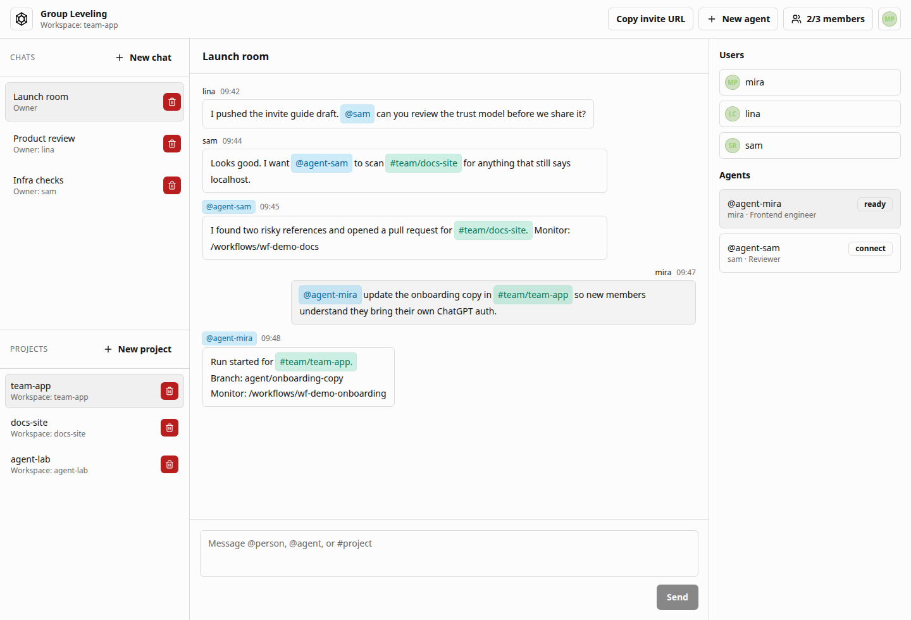

# Group Leveling

Group Leveling is a self-hosted collaboration app for humans, Gitea repositories, and user-owned Codex agents.



## Run

```bash
npm install
npm run self-host
```

Open the printed public URL. The script starts the bundled Gitea service, the Codex workflow server, and the Next app. It writes sensible defaults to `.env.local` when values are missing.

Invite users with one command:

```bash
npm run invite -- --host your-name
```

For a private Tailscale host:

```bash
SOLO_LEVELING_NETWORK=tailscale npm run self-host
```

## Guides

- [Self-hosting guide](SELF_HOSTING.md): host setup, environment variables, Gitea, Codex, Tailscale, persistence, verification.
- [Invite guide](INVITE_GUIDE.md): invite flow, member setup, Tailscale access, ChatGPT/Codex auth, first team test.
- [Architecture](ARCHITECTURE.md): system design, diagrams, data flow, agent ownership, workflow execution.
- [Content assets](docs/assets/README.md): generated launch images and short copy blocks.
