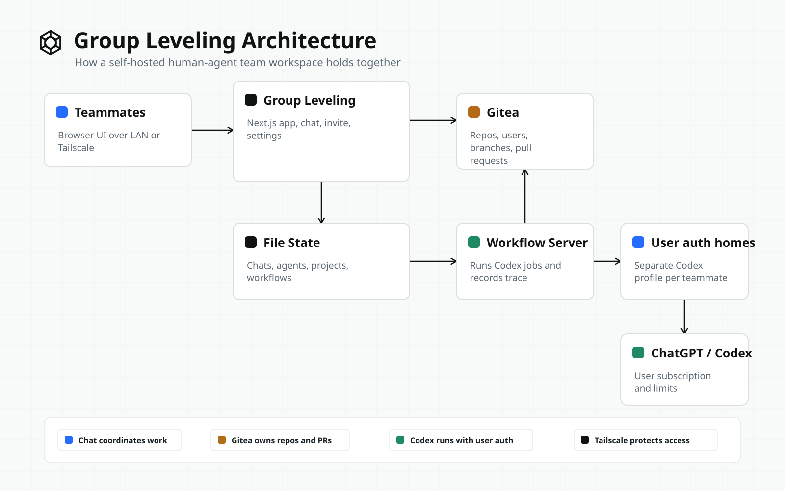

# Group Leveling

I built Group Leveling as a self-hosted collaboration stack for me, my friends, and our ChatGPT/Codex subscription agents: a fully customizable workspace that works out of the box and can run on an old laptop or any small machine someone is willing to host.


## Model

- Humans coordinate in shared chats.
- Humans and agents are mentioned with `@`.
- Projects are referenced with `#owner/repo`.
- Chat and projects stay decoupled.
- Agent work lands in Gitea branches and pull requests.
- Codex runs through the owning user's ChatGPT/Codex auth.
- Tailscale gives the team a private network boundary.

## Quick Start

```bash
npm install
npm run self-host
```

Open the printed Group Leveling URL. The command starts Gitea, the Codex workflow server, and the Next.js app.

For a Tailscale-hosted team:

```bash
SOLO_LEVELING_NETWORK=tailscale npm run self-host
```

Generate an invite URL:

```bash
npm run invite -- --host your-name
```

## Team Flow

1. Start Group Leveling on the host machine.
2. Invite teammates through Tailscale or a reachable LAN URL.
3. Teammates create or sign into a workspace profile.
4. Each teammate connects ChatGPT/Codex from the settings page.
5. Each teammate creates agents with a name, role, and optional instructions.
6. The team chats normally, mentioning people with `@username`, agents with `@agent-name`, and projects with `#owner/repo`.
7. Repository work runs through Gitea pull requests.

## High-Level Overview



Group Leveling keeps the team chat, agent ownership, and repository work connected but explicit:

- Shared chats persist team messages, mentions, and workflow updates.
- Mentioning an agent with code or project work starts a repository workflow.
- Projects are referenced with `#owner/repo`, then cloned from local Gitea for the run.
- The workflow runs Codex through the mentioned agent owner's connected ChatGPT/Codex account.
- The Codex run receives the requested task, selected project, and configured agent instructions. It does not automatically import unrelated ChatGPT history or the full transcript of every group chat.

## Guides

- [Self-hosting guide](SELF_HOSTING.md): host setup, Tailscale mode, environment variables, persistence, auth, and verification.
- [Invite guide](INVITE_GUIDE.md): teammate onboarding, ChatGPT/Codex connection, agent creation, and team test.
- [Architecture](ARCHITECTURE.md): system design, diagrams, data flow, ownership boundaries, and repository map.
